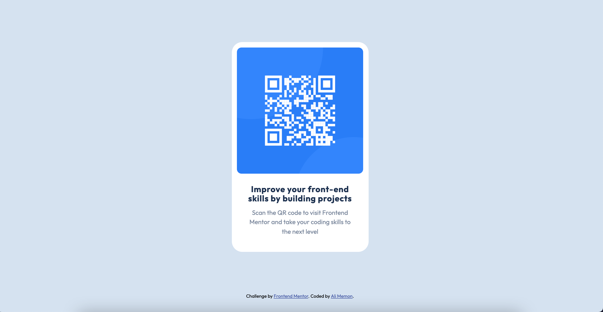

# Frontend Mentor - QR code component solution

This is a solution to the [QR code component challenge on Frontend Mentor](https://www.frontendmentor.io/challenges/qr-code-component-iux_sIO_H). Frontend Mentor challenges help you improve your coding skills by building realistic projects. 

## Table of contents

- [Overview](#overview)
  - [Screenshot](#screenshot)
  - [Links](#links)
- [My process](#my-process)
  - [Built with](#built-with)
  - [What I learned](#what-i-learned)
  - [Continued development](#continued-development)
- [Author](#author)

## Overview

### Screenshot

### Links

- Solution URL: [Add solution URL here](https://www.frontendmentor.io/solutions/simple-card-layout-Ahc5KKD5A)
- Live Site URL: [Add live site URL here](https://alirmemon37.github.io/simple-card-layout/)

## My process

### Built with

- Semantic HTML5 markup
- CSS custom properties

### What I learned

How to build a Simple card layout and style it using CSS.

### Continued development

Next I would try building layouts using CSS Flexbox and CSS Grid.

## Author

- Website - [Ali Memon](Currently not available)
- Frontend Mentor - [@alirmemon37](https://www.frontendmentor.io/profile/alirmemon37)
